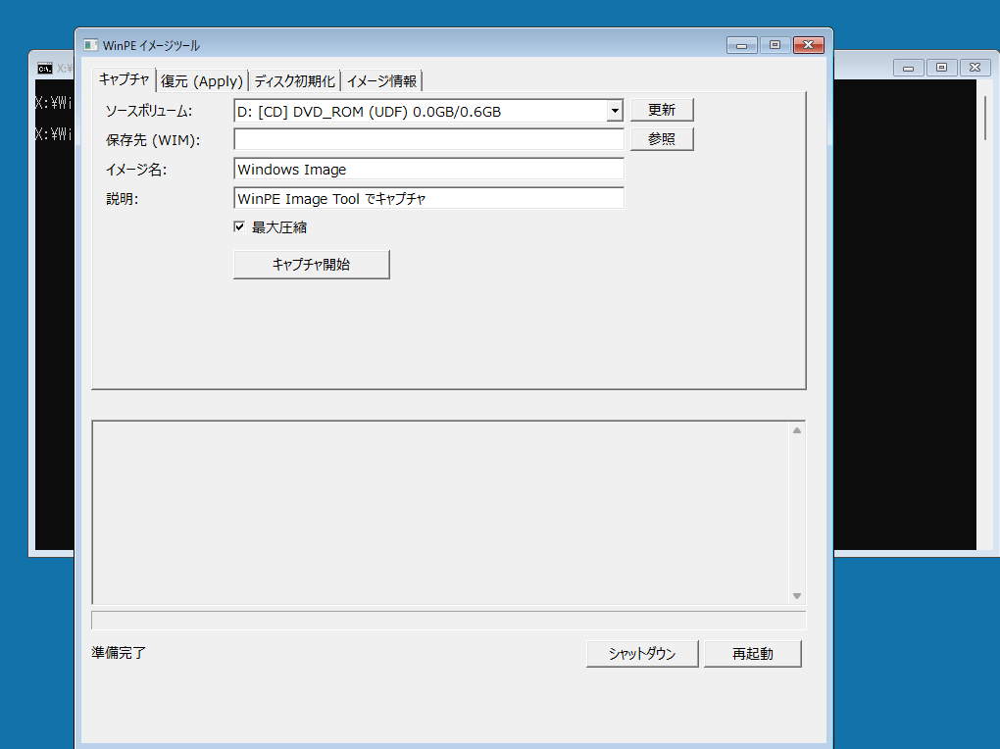
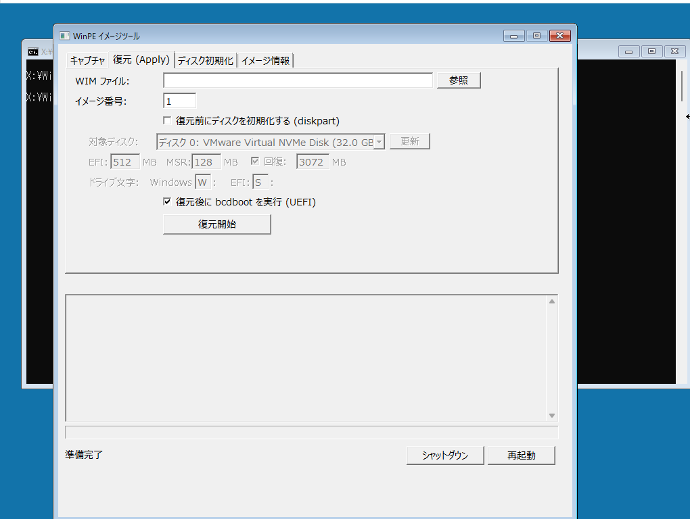
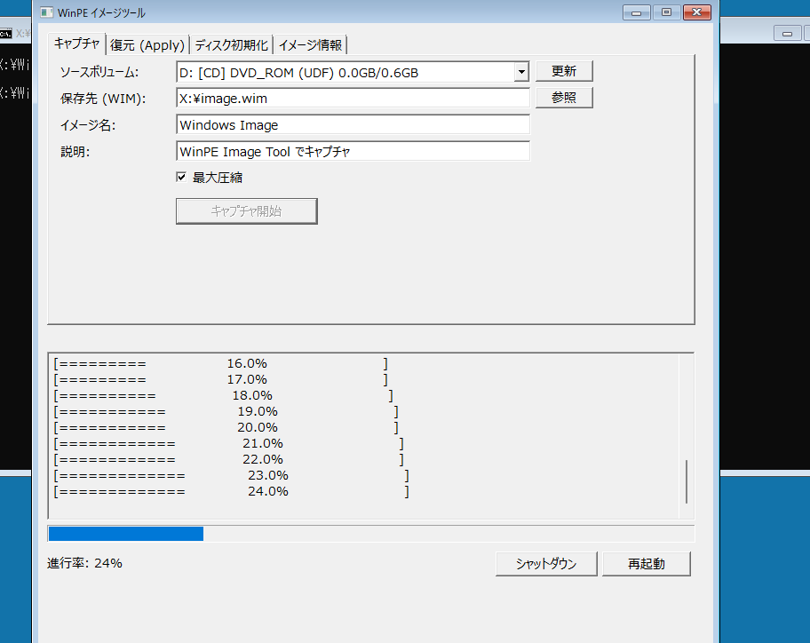

# WinPE Image Tool

WinPE 環境向けのディスクイメージング GUI ツールです。  
DISM によるキャプチャ/復元、diskpart によるGPTパーティション作成、bcdboot によるブート構成を、ランタイム不要の単一 EXE で実現します。


---

## 機能一覧

### キャプチャ

ボリュームを WIM イメージとして保存します。圧縮率（最大 / 高速）を選択可能です。

### 復元 (Apply)

WIM / ESD イメージをディスクに展開します。以下のオプションを組み合わせて一括実行できます。

- **ディスク初期化** — diskpart による GPT パーティション自動作成
- **イメージ展開** — DISM による WIM 適用
- **ブート構成** — bcdboot による UEFI ブートエントリ作成

チェックボックスで各ステップの有無を制御でき、失敗時は自動的に中断します。

### ディスク初期化

GPT パーティションレイアウトを自動作成します。

| パーティション | ファイルシステム | デフォルトサイズ | 備考 |
|---|---|---|---|
| EFI System | FAT32 | 512 MB | ドライブレター指定可 |
| MSR | — | 128 MB | |
| Recovery | NTFS | 3,072 MB | 作成有無を選択可 |
| Windows | NTFS | 残り全容量 | ドライブレター指定可 |

各サイズは UI から自由に変更できます。

### イメージ情報

WIM ファイルに含まれるイメージのインデックス一覧と詳細情報を表示します。

### その他

- **物理ディスク選択** — モデル名・容量付きのドロップダウンで対象ディスクを選択
- **シャットダウン / 再起動** — wpeutil によるシステム制御ボタン
- **日本語 UI** — フォント自動検出 (Meiryo UI → Yu Gothic UI → MS UI Gothic → Segoe UI)
- **リアルタイムログ** — DISM / diskpart の出力をそのまま表示
- **プログレスバー** — DISM の進捗率を自動解析して表示

---

## スクリーンショット





---

## ビルド方法

### 必要なもの

- Visual Studio 2022（C++ Desktop ワークロード）
- Windows SDK
- C++17 対応

### ビルド手順

#### MSVC（推奨）

```bat
cl /O2 /W4 /EHsc /MT /DUNICODE /D_UNICODE /std:c++17 main.cpp ^
   /Fe:WinPE-ImageTool.exe /link /SUBSYSTEM:WINDOWS ^
   user32.lib gdi32.lib comctl32.lib comdlg32.lib shell32.lib ole32.lib
```

または同梱の `build_msvc.bat` を Developer Command Prompt で実行してください。

#### MinGW（代替）

```bat
g++ -O2 -mwindows -municode -DUNICODE -D_UNICODE -std=c++17 main.cpp ^
    -o WinPE-ImageTool.exe ^
    -luser32 -lgdi32 -lcomctl32 -lcomdlg32 -lshell32 -lole32
```

### 重要: `/MT` フラグ

WinPE には Visual C++ ランタイム (vcruntime140.dll 等) が含まれていないため、**必ず `/MT` で静的リンク**してください。`/MD` でビルドすると WinPE 上で起動に失敗します。

---

## WinPE への導入

### 1. EXE を配置

ビルドした `WinPE-ImageTool.exe` を WinPE イメージ内にコピーします。

```bat
Dism /Mount-Image /ImageFile:C:\winpe\media\sources\boot.wim /Index:1 /MountDir:C:\winpe\mount
copy WinPE-ImageTool.exe C:\winpe\mount\Windows\System32\
```

### 2. 自動起動を設定

`startnet.cmd` にツールの起動コマンドを追加します。

```bat
echo start WinPE-ImageTool.exe >> C:\winpe\mount\Windows\System32\startnet.cmd
```

`startnet.cmd` の中身:

```bat
wpeinit
start WinPE-ImageTool.exe
```

`start` を使うことで GUI を起動しつつ、コマンドプロンプトも同時に利用できます。

### 3. アンマウントして ISO 作成

```bat
Dism /Unmount-Image /MountDir:C:\winpe\mount /Commit
```

---

## 使い方

### イメージのキャプチャ（バックアップ）

1. **キャプチャ** タブを開く
2. ソースボリュームを選択（例: `C:` ドライブ）
3. 保存先の WIM ファイルパスを指定
4. 「キャプチャ開始」をクリック

### イメージの復元（デプロイ）

#### ディスク初期化 + 復元 + ブート構成（フルデプロイ）

1. **復元** タブを開く
2. WIM ファイルを選択し、イメージ番号を指定
3. 「復元前にディスクを初期化する」にチェック
4. 対象ディスクをドロップダウンから選択
5. パーティションサイズ・ドライブレターを必要に応じて変更
6. 「復元後に bcdboot を実行」にチェック（デフォルト ON）
7. 「復元開始」をクリック

自動的に以下を順番に実行します:

1. diskpart でディスク初期化 (GPT + パーティション作成)
2. DISM でイメージ展開
3. bcdboot でブートエントリ作成

#### 既存パーティションへの復元のみ

1. チェックボックスを外し、WIM ファイルとインデックスだけ指定
2. ドライブレター欄に復元先のドライブ文字を入力
3. 「復元開始」をクリック

### ディスク初期化のみ

1. **ディスク初期化** タブを開く
2. 対象ディスクを選択
3. 各パーティションサイズを調整
4. 「ディスク初期化実行」をクリック

---

## 技術仕様

| 項目 | 内容 |
|---|---|
| 言語 | C++17 (Win32 API) |
| 外部依存 | なし（OS 標準 DLL のみ） |
| UI フレームワーク | Win32 Common Controls (Tab, ComboBox, Progress, Edit) |
| バックエンド | DISM.exe, diskpart.exe, bcdboot.exe, wpeutil.exe |
| 文字コード | Unicode (UTF-16LE) |
| ディスク列挙 | DeviceIoControl (IOCTL_DISK_GET_DRIVE_GEOMETRY_EX, IOCTL_STORAGE_QUERY_PROPERTY) |
| プロセス制御 | CreateProcessW + パイプによる stdout/stderr キャプチャ |
| diskpart 連携 | スクリプトファイル方式 (`diskpart /s`) |

---

## ファイル構成

```
WinPE-ImageTool/
├── main.cpp           # ソースコード（単一ファイル）
├── build_msvc.bat     # MSVC ビルドスクリプト
├── build_mingw.bat    # MinGW ビルドスクリプト（代替）
├── README.md　　　　　 # れどみ
├── dousa.png
├── TOP.pnng
├── hukugen.png
└── LICENSE

```

---

## 注意事項

- **ディスク初期化は不可逆操作です。** 対象ディスクのデータはすべて消去されます。実行前に必ず確認ダイアログが表示されます。
- WinPE 以外の通常の Windows 環境でも動作しますが、システムドライブへの操作は避けてください。
- `wpeutil.exe` は WinPE 環境でのみ利用可能です。通常の Windows ではシャットダウン / 再起動ボタンは機能しません。
- 作者はこのツールを使用して問題が発生したとしても関知しません。

---

## ライセンス

[MIT License](LICENSE)

---

## 謝辞

このツールは以下の Windows コンポーネントを利用しています:

- [DISM (Deployment Image Servicing and Management)](https://learn.microsoft.com/ja-jp/windows-hardware/manufacture/desktop/dism-image-management-command-line-options-s14)
- [DiskPart](https://learn.microsoft.com/ja-jp/windows-server/administration/windows-commands/diskpart)
- [BCDBoot](https://learn.microsoft.com/ja-jp/windows-hardware/manufacture/desktop/bcdboot-command-line-options-techref-di)
